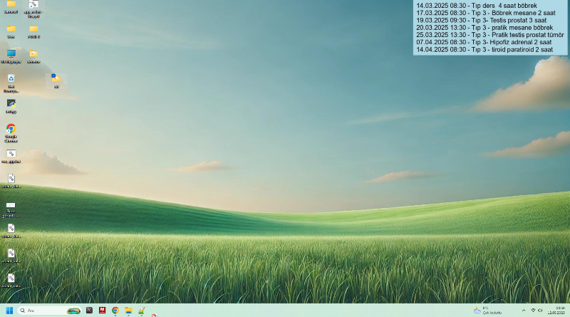

# Dynamic Wallpaper with Calendar Events Overlay

Bu proje, herkese açık bir Google Takvim veya iCal URL'sinden çekilen etkinlikleri alıp, Windows masaüstü arka planınıza sağ üst köşede dinamik olarak ekleyen bir Python script'idir. Etkinlikler Türkiye saat dilimine (Europe/Istanbul) göre biçimlendirilir ve her güncellemede otomatik olarak yenilenir.

## Özellikler

- **Herkese Açık Takvim Entegrasyonu:**  
  Takviminizden iCal URL'si ile etkinlik verilerini çekin.
  
- **Dinamik Wallpaper Güncelleme:**  
  Etkinlikleri sağ üst köşede, "dd.mm.yyyy HH:MM - Etkinlik Adı" formatında gösterir.
  
- **Zaman Dilimi Dönüşümü:**  
  Etkinlik zamanı UTC'den Türkiye saatine çevrilir.

- **Görsel Çıktı:**  
  Güncellenmiş masaüstü resmi **masaustu_modified.jpg** olarak kaydedilir ve sistem arka planı otomatik olarak değiştirilir.

- **Örnek Çıktı:**  
  Proje ile oluşturulan ekran görüntüsü `screen.png` dosyasında yer almaktadır.

## Gereksinimler

- Python 3.9 veya üstü (zoneinfo modülü için)
- [Pillow](https://pillow.readthedocs.io/)  
- [ics](https://pypi.org/project/ics/)  
- [requests](https://pypi.org/project/requests/)

Gerekli paketleri yüklemek için:

```bash
pip install Pillow ics requests
```

## Kurulum

1. Bu depoyu klonlayın:

   ```bash
   git clone https://github.com/metinciris/Dynamic-Wallpaper-with-Calendar-Events-Overlay
   cd dynamic-wallpaper-calendar
   ```

2. **iCal URL'nizi** `takvimwallpaper.py` dosyasında `ical_url` değişkenine ekleyin:

   ```python
   ical_url = "YOUR_PUBLIC_ICAL_URL"  # Takviminizin iCal URL'si
   ```

3. Masaüstü resminizi `C:\Users\User\Pictures\masaustu.jpg` yoluna yerleştirin ya da dosya yolunu güncelleyin.

## Kullanım

Script'i çalıştırdığınızda:
- iCal URL'sinden etkinlik verileri çekilir.
- Etkinlikler, Türkiye saatine göre biçimlendirilip sağ üst köşede gösterilir.
- Oluşturulan yeni resim masaüstü arka planı olarak ayarlanır.

Script'i çalıştırmak için:

```bash
python takvimwallpaper.py
```

## başlangıçta çalıştırma
Aşağıdaki BAT dosyası içeriğini "takvimwallpaper.bat" şeklinde kaydedebilirsiniz. Bu dosya, bilgisayar açılışında Python script'inizi çalıştıracaktır:
```bash
@echo off
REM Gerekirse 10 saniye bekle (sistem ve ağ bağlantısının hazır olması için)
timeout /t 10 /nobreak

REM Python'un PATH'e ekli olduğundan emin olun. Değilse tam yolunu yazın.
python "C:\py\takvimwallpaper.py"
```
Dosyayı açılır menüdeki Başlangıç klasörüne kopyalayın:
Çalıştır (Win + R) komutuna %APPDATA%\Microsoft\Windows\Start Menu\Programs\Startup yazın ve Enter'a basın.
Açılan klasöre "takvimwallpaper.bat" dosyasını yapıştırın.
Böylece bilgisayar açıldığında BAT dosyası otomatik olarak çalışacak ve script'iniz güncel masaüstü arka planını ayarlayacaktır.

## Ekran Görüntüsü

Aşağıda oluşturulan masaüstü arka planının örnek görüntüsü bulunmaktadır:



## Zamanlayıcı ile Güncelleme

Script'i Windows Görev Zamanlayıcısı gibi araçlar kullanarak belirli aralıklarla otomatik olarak çalıştırabilir, masaüstü arka planınızın sürekli güncel kalmasını sağlayabilirsiniz.

## Lisans

Bu proje MIT Lisansı altında lisanslanmıştır. 
